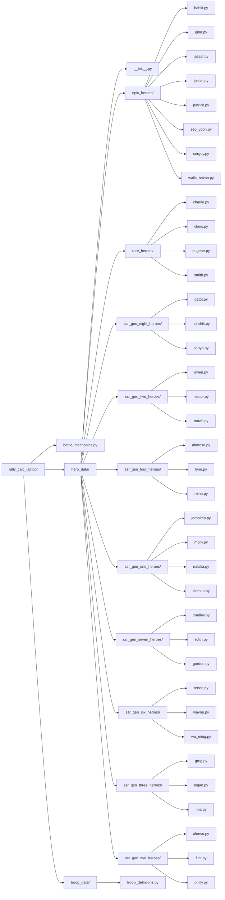

# Rally Calc Laptop

This project is a toolkit for simulating and analyzing battle and rally mechanics, hero data, and troop data for a strategy game. The codebase is organized into modules for battle mechanics, hero and troop data, and supporting documentation.

## File Organization

Below is a Mermaid diagram visualizing the file and folder structure of the project in a left-to-right outline format (excluding the Archive and Docs folders):

---

This diagram provides a high-level overview of the folder and file organization for easy navigation and understanding of the codebase.
