# Rally Calc Laptop

This project is a toolkit for simulating and analyzing battle and rally mechanics, hero data, and troop data for a strategy game. The codebase is organized into modules for battle mechanics, hero and troop data, and supporting documentation.

Setup:

```bash
python3 -m venv env
source env/bin/activate        # macOS/Linux
# .\env\Scripts\Activate.ps1   # Windows PowerShell
pip install fastapi uvicorn
```

Run the server:

```bash
cd server
uvicorn main:app --reload --host 0.0.0.0 --port 8000
```

Creating the front-end:

```bash
npm install -g expo-cli
expo init BattleSimApp   # choose "blank (TypeScript)"
cd BattleSimApp
npm install axios @react-native-picker/picker
```

Run the App:

```bash
npx expo start
```

now press w for web.. if react 19.1 is not installed, open a new terminal and install it, then reattempt pressing w in the node terminal.

```bash
npx expo install react@19.1.0

npx expo install react-native-web @expo/metro-runtime
```

To Restart the FastAPI:

```bash
uvicorn main:app --reload
```

To restart the Expo app:

```bash
npx expo start
```

TO UPDATE GITHUB:

```bash
git add .
git commit -m "Your commit message"
git push origin main
```

## File Organization

Below is a Mermaid diagram visualizing the file and folder structure of the project in a left-to-right outline format (excluding the Archive and Docs folders):

```mermaid
flowchart LR
  A["rally_calc_laptop/"]
  A1["BattleSimApp/"]
  A2["server/"]
  A3["test.py"]
  A4["requirements.txt"]
  A5["README.md"]

  A --> A1
  A --> A2
  A --> A3
  A --> A4
  A --> A5

  %% BattleSimApp contents
  A1 --> A1a["app.json"]
  A1 --> A1b["App.tsx"]
  A1 --> A1c["assets/"]
  A1 --> A1d["index.ts"]
  A1 --> A1e["package-lock.json"]
  A1 --> A1f["package.json"]
  A1 --> A1g["tsconfig.json"]

  A1c --> A1c1["adaptive-icon.png"]
  A1c --> A1c2["favicon.png"]
  A1c --> A1c3["icon.png"]
  A1c --> A1c4["splash-icon.png"]

  %% Server contents
  A2 --> A2a["battle_mechanics.py"]
  A2 --> A2b["main.py"]
  A2 --> A2c["hero_data/"]
  A2 --> A2d["troop_data/"]

  %% hero_data subfolders
  A2c --> A2c1["__init__.py"]
  A2c --> A2c2["epic_heroes/"]
  A2c --> A2c3["hero_loader.py"]
  A2c --> A2c4["rare_heroes/"]
  A2c --> A2c5["ssr_gen_eight_heroes/"]
  A2c --> A2c6["ssr_gen_five_heroes/"]
  A2c --> A2c7["ssr_gen_four_heroes/"]
  A2c --> A2c8["ssr_gen_one_heroes/"]
  A2c --> A2c9["ssr_gen_seven_heroes/"]
  A2c --> A2c10["ssr_gen_six_heroes/"]
  A2c --> A2c11["ssr_gen_three_heroes/"]
  A2c --> A2c12["ssr_gen_two_heroes/"]

  %% epic_heroes
  A2c2 --> A2c2a["__init__.py"]
  A2c2 --> A2c2b["bahiti.py"]
  A2c2 --> A2c2c["gina.py"]
  A2c2 --> A2c2d["jassar.py"]
  A2c2 --> A2c2e["jessie.py"]
  A2c2 --> A2c2f["patrick.py"]
  A2c2 --> A2c2g["seo_yoon.py"]
  A2c2 --> A2c2h["sergey.py"]
  A2c2 --> A2c2i["walis_bokan.py"]

  %% rare_heroes
  A2c4 --> A2c4a["__init__.py"]
  A2c4 --> A2c4b["charlie.py"]
  A2c4 --> A2c4c["cloris.py"]
  A2c4 --> A2c4d["eugene.py"]
  A2c4 --> A2c4e["smith.py"]

  %% ssr_gen_eight_heroes
  A2c5 --> A2c5a["__init__.py"]
  A2c5 --> A2c5b["gatot.py"]
  A2c5 --> A2c5c["hendrik.py"]
  A2c5 --> A2c5d["sonya.py"]

  %% ssr_gen_five_heroes
  A2c6 --> A2c6a["__init__.py"]
  A2c6 --> A2c6b["gwen.py"]
  A2c6 --> A2c6c["hector.py"]
  A2c6 --> A2c6d["norah.py"]

  %% ssr_gen_four_heroes
  A2c7 --> A2c7a["__init__.py"]
  A2c7 --> A2c7b["ahmose.py"]
  A2c7 --> A2c7c["lynn.py"]
  A2c7 --> A2c7d["reina.py"]

  %% ssr_gen_one_heroes
  A2c8 --> A2c8a["__init__.py"]
  A2c8 --> A2c8b["jeronimo.py"]
  A2c8 --> A2c8c["molly.py"]
  A2c8 --> A2c8d["natalia.py"]
  A2c8 --> A2c8e["zinman.py"]

  %% ssr_gen_seven_heroes
  A2c9 --> A2c9a["__init__.py"]
  A2c9 --> A2c9b["bradley.py"]
  A2c9 --> A2c9c["edith.py"]
  A2c9 --> A2c9d["gordon.py"]

  %% ssr_gen_six_heroes
  A2c10 --> A2c10a["__init__.py"]
  A2c10 --> A2c10b["renee.py"]
  A2c10 --> A2c10c["wayne.py"]
  A2c10 --> A2c10d["wu_ming.py"]

  %% ssr_gen_three_heroes
  A2c11 --> A2c11a["__init__.py"]
  A2c11 --> A2c11b["greg.py"]
  A2c11 --> A2c11c["logan.py"]
  A2c11 --> A2c11d["mia.py"]

  %% ssr_gen_two_heroes
  A2c12 --> A2c12a["alonso.py"]
  A2c12 --> A2c12b["flint.py"]
  A2c12 --> A2c12c["philly.py"]

  %% troop_data
  A2d --> A2d1["__init__.py"]
  A2d --> A2d2["troop_definitions.py"]
```



---

This diagram provides a high-level overview of the folder and file organization for easy navigation and understanding of the codebase.
